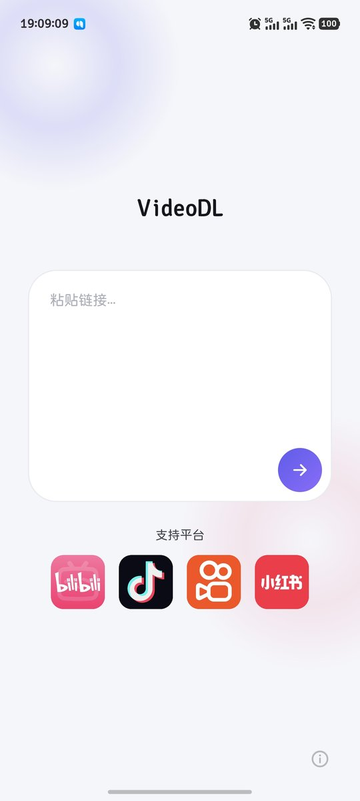

# VideoDL

> 纯本地的短视频/图集解析下载器 —— 无第三方解析服务器、无广告、无需登录。

  

---

## 🤖 一 · 如果你是 AI

### 项目说明

这是一个 **Android 视频下载器**：用户从抖音 / B站 / 快手 / 小红书复制分享链接（或系统"分享到"本 App），App **在本地**完成解析，拿到无水印直链后把视频或图集下载到公共下载目录，全程不经过任何第三方解析服务器。

---

## 🙋 二 · 如果你是人类

### 这是个啥？

一个装在安卓手机上的**视频保存小工具**。你在抖音、B站、快手、小红书刷到想收藏的视频或图片，复制一条链接发给它，它就把**无水印的原视频/高清原图**存进你手机的「下载」相册目录里。

它跟你见过的大部分"解析工具"不一样：**不需要关注公众号、没有广告、没有解析次数限制**——因为解析全过程就在你手机上完成，根本不经过别人的服务器。

### 它能干什么

- **抖音**：视频（无水印）和多图笔记都能下；
- **B站**：视频下载，不登录就有 720P，登录 cookie 可以更高清；
- **快手**：视频，自动挑画质最好的那一档；
- **小红书**：视频笔记和图文笔记都能下，实况照片会存下高清大图；

### 怎么安装

把 `dist/VideoDL-1.0.apk` 传到手机上安装

### 怎么用

在抖音/B站/快手/小红书里点「分享」→「复制链接」
